# Data Warehouse Implementation on Daraz Dataset

## 📌 Project Overview

This project focuses on building a centralized **Data Warehouse** for the Daraz dataset.  
The objective is to collect, transform, store, and analyze data from multiple CSV sources to support better business intelligence and decision-making.

The project includes:
- ETL (Extract, Transform, Load) Pipeline
- Data Cleaning & Transformation
- Data Denormalization
- SQLite Database Storage
- Data Visualization using Python & Power BI

---

# 🏗️ Architecture Overview

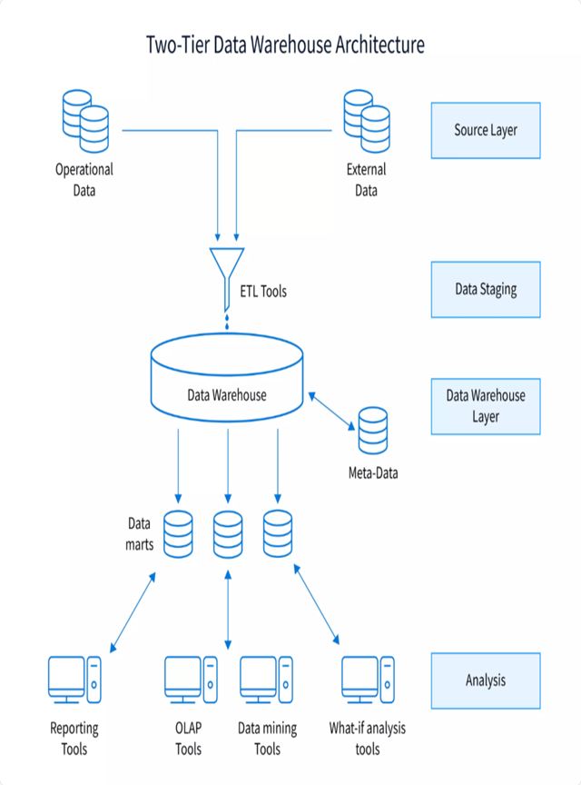

---

# ⚙️ Technologies Used

- **Python**
- **Pandas**
- **SQLite**
- **Matplotlib**
- **Power BI**

---

# 📂 Dataset Files

### Sales.csv
Contains:
- Sales transactions
- Sale amounts
- Sales regions
- Quantities sold

### Product.csv
Contains:
- Product titles
- Categories
- Product attributes

### Reviews.csv
Contains:
- Customer reviews
- Ratings
- Product identifiers

**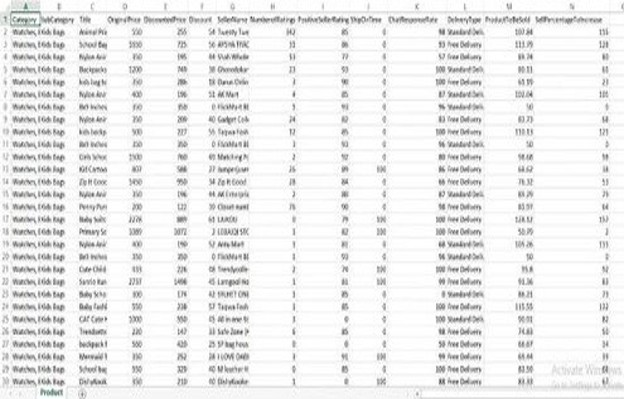
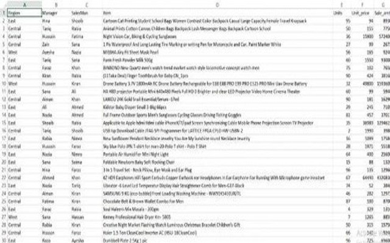
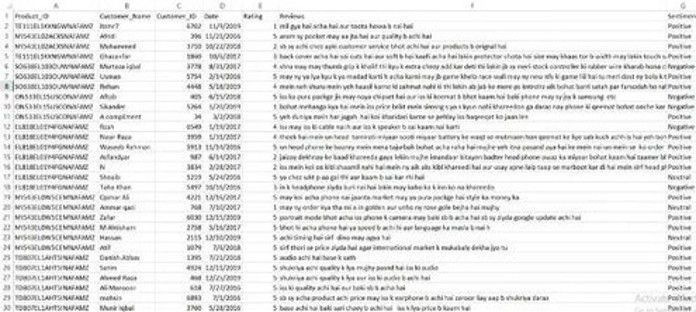
**---

# 🔄 ETL Process

## 1️⃣ Extract

Data was extracted from CSV files using **Python Pandas**.

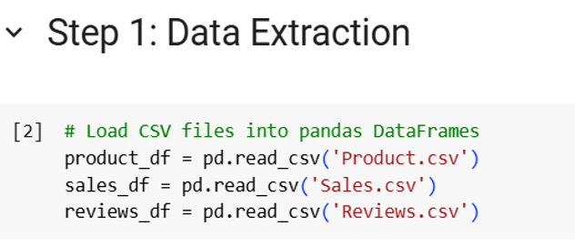

---

## 2️⃣ Transform

The transformation phase included:
- Handling missing values
- Removing duplicates
- Formatting date/time fields
- Creating new columns
- Data validation

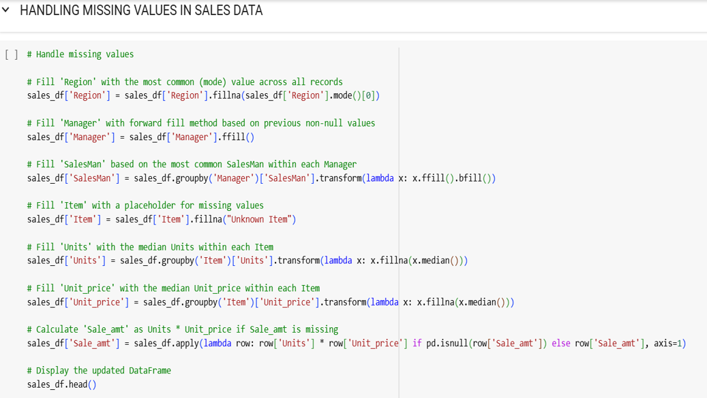
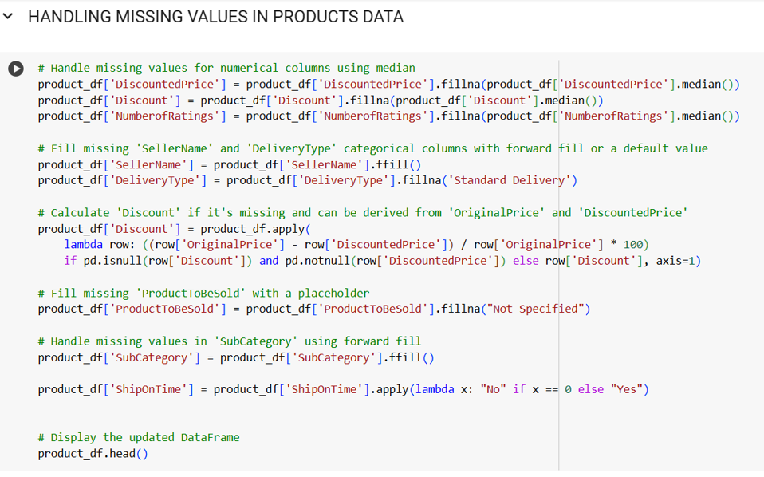
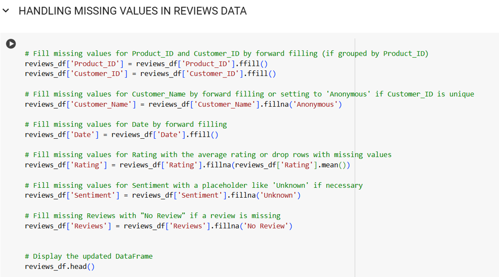
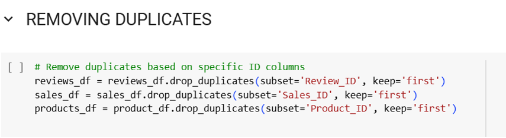
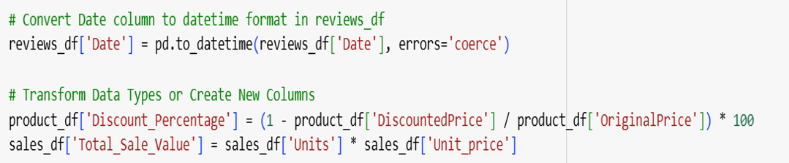
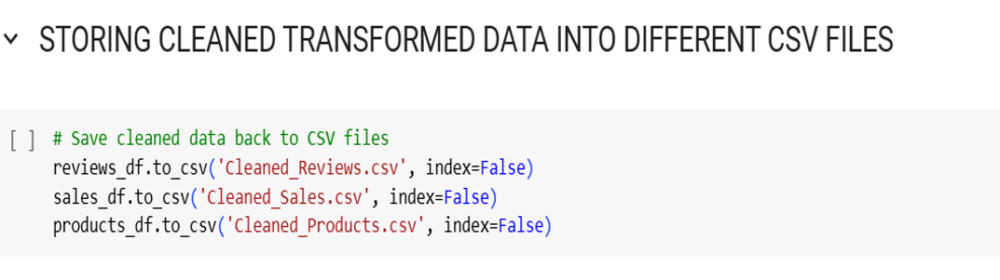

---

## 3️⃣ Denormalization

Sales and Product data were merged into:
- Product-Sales Table
- Product-Reviews Table

This improved query performance and reporting efficiency.

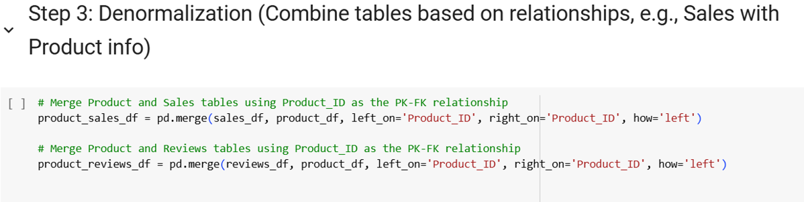

---

## 4️⃣ Load

The transformed data was loaded into:
- `project_database.db`

using **SQLite** for structured storage and fast querying.

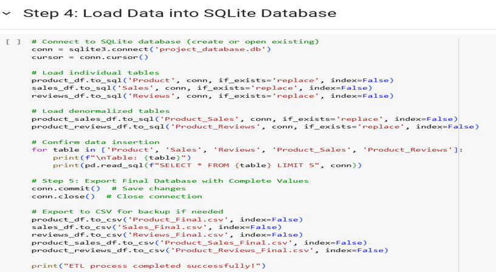

---

# 📊 Data Visualization

The project includes:
- KPI dashboards
- Sales performance analysis
- Category-wise sales breakdown
- Regional sales insights
- Trend analysis

### Power BI Dashboard Features
- Total Sales Metrics
- Units Sold by Category
- Region-wise Sales
- Product Demand Analysis
- Delivery Type Analysis

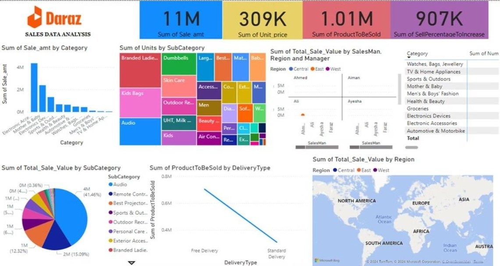

---

# 📈 Key Insights

- Improved accessibility to centralized business data
- Faster analytical queries
- Enhanced reporting capabilities
- Better trend identification
- Data-driven business decision support

---

# 🚀 Future Improvements

- Real-time data integration
- Cloud data warehouse deployment
- Automated ETL scheduling
- Advanced predictive analytics

---

# 🙌 Conclusion

This project successfully demonstrates the implementation of a **Data Warehouse** using Daraz sales data, integrating ETL processes, database storage, and visual analytics to support efficient business intelligence operations.

---

# ⭐ Thank You
